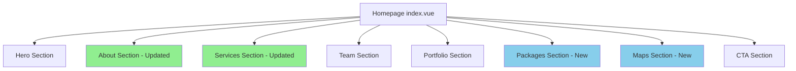

# Design Document: Homepage Content Update

## Overview

This design document outlines the technical approach for updating the Reneo Planner wedding organizer homepage. The implementation involves modifying the existing Vue 3 component (`app/pages/index.vue`) to update content, remove sections, and add new sections while maintaining the existing design system and Nuxt UI v4 components.

The changes are primarily content-focused with some structural modifications:
- Content updates to About Us and Services sections
- Removal of Statistics section and Testimonials section
- Addition of new Packages section
- Addition of Google Maps integration section

## Architecture

### Current Architecture

The homepage is a single-file Vue component using:
- Vue 3 Composition API with `<script setup>`
- Nuxt UI v4 components (UButton, UCard, UContainer, UIcon)
- Reactive data for carousel functionality
- CSS animations for scroll effects

### Proposed Changes



**Removed Sections:**
- Statistics Section (between About and Services)
- Testimonials Section (after Portfolio)

**New Sections:**
- Packages Section (after Portfolio)
- Maps Section (after Packages, before CTA)

## Components and Interfaces

### Data Structures

#### Updated Carousel Slides
```typescript
interface CarouselSlide {
  image: string
  title: string
  description: string
}

// Updated to reflect 2023 founding and accurate information
const carouselSlides: CarouselSlide[] = [
  {
    image: string,
    title: 'Sejak 2023',
    description: 'Membantu pasangan menciptakan pernikahan bermakna di Surabaya'
  },
  // ... more slides with updated content
]
```

#### Updated Services
```typescript
interface Service {
  title: string
  description: string
  icon: string
}

// 4 core services
const services: Service[] = [
  { title: 'KONSULTASI', description: string, icon: string },
  { title: 'BUDGETING', description: string, icon: string },
  { title: 'CONCEPT', description: string, icon: string },
  { title: 'KOORDINASI', description: string, icon: string }
]
```

#### New Wedding Packages
```typescript
interface WeddingPackage {
  name: string
  guestRange: string
  features: string[]
  freeItems: string[]
}

const packages: WeddingPackage[] = [
  {
    name: 'Prajurit Package',
    guestRange: '100-300 Tamu',
    features: [
      'Konsultasi Wedding Unlimited',
      'Koordinasi Vendor (H-30 hari)',
      // ... more features
    ],
    freeItems: ['Used Nampan Melati']
  },
  // Abdi Dalem and Sultan packages
]
```

### Component Structure

#### Packages Section Component
```vue
<!-- Packages Section -->
<section id="packages" class="py-20 bg-white">
  <UContainer>
    <div class="text-center mb-16">
      <p class="text-primary font-medium mb-2 uppercase tracking-wide">Paket Kami</p>
      <h2 class="text-4xl md:text-5xl font-serif font-bold mb-4 text-gray-900">
        Paket Layanan Kami
      </h2>
    </div>
    <div class="grid md:grid-cols-3 gap-8">
      <UCard v-for="pkg in packages" :key="pkg.name">
        <!-- Package content -->
      </UCard>
    </div>
  </UContainer>
</section>
```

#### Maps Section Component
```vue
<!-- Maps Section -->
<section id="location" class="py-20 bg-gray-50">
  <UContainer>
    <div class="text-center mb-16">
      <h2>Lokasi & Ulasan</h2>
    </div>
    <div class="grid lg:grid-cols-2 gap-8">
      <!-- Embedded Google Maps iframe -->
      <div class="rounded-lg overflow-hidden">
        <iframe 
          src="https://www.google.com/maps/embed?pb=..." 
          width="100%" 
          height="400"
          loading="lazy"
        ></iframe>
      </div>
      <!-- Reviews link/info -->
      <div>
        <!-- Google Maps reviews link -->
      </div>
    </div>
  </UContainer>
</section>
```

## Data Models

### Package Data Model

```typescript
// Package feature categories for display
interface PackageFeature {
  text: string
  isFree: boolean
}

interface WeddingPackage {
  id: string
  name: string
  tier: 'prajurit' | 'abdi-dalem' | 'sultan'
  guestRange: {
    min: number
    max: number
  }
  features: PackageFeature[]
  eventDuration: string  // e.g., "4 Jam Acara"
  crewCount: number
}
```

### Maps Configuration

```typescript
interface MapsConfig {
  embedUrl: string
  placeUrl: string  // https://maps.app.goo.gl/YgQcDsoE1JfFFR9p7
  placeName: string
}
```

### Content Data Model

```typescript
interface AboutContent {
  foundingYear: number
  location: string
  vision: string
  story: string
  namePhilosophy: {
    re: string
    neo: string
  }
  values: string
}

interface ServiceContent {
  title: string
  icon: string
  description?: string
}
```


## Correctness Properties

*A property is a characteristic or behavior that should hold true across all valid executions of a system—essentially, a formal statement about what the system should do. Properties serve as the bridge between human-readable specifications and machine-verifiable correctness guarantees.*

Based on the prework analysis, most requirements are specific content checks (examples) rather than universal properties. However, the following properties can be derived:

### Property 1: No Pricing in Packages

*For any* wedding package displayed in the Packages_Section, the rendered content SHALL NOT contain any pricing information (currency symbols like "Rp", "IDR", or numeric price patterns).

**Validates: Requirements 4.5**

### Property 2: Free Items Visibility

*For any* wedding package that has free items defined, the rendered package card SHALL display all free items associated with that package.

**Validates: Requirements 4.6**

### Property 3: Statistics Content Removal

*For any* rendered state of the Homepage, the DOM SHALL NOT contain any of the removed statistics text ("500+ Pernikahan Diselenggarakan", "500+ Pasangan Bahagia", "10+ Tahun Pengalaman", "25+ Anggota Tim").

**Validates: Requirements 3.1, 3.2, 3.3, 3.4**

### Property 4: Service Count Invariant

*For any* rendered state of the Services_Section, the section SHALL display exactly 4 service items.

**Validates: Requirements 2.1**

## Error Handling

### Google Maps Embed Errors

| Error Scenario | Handling Strategy |
|----------------|-------------------|
| Maps iframe fails to load | Display fallback message with direct link to Google Maps |
| Invalid embed URL | Log error, show placeholder with link to maps.app.goo.gl URL |
| Network timeout | Show loading state, then fallback link after timeout |

### Content Loading

| Error Scenario | Handling Strategy |
|----------------|-------------------|
| Image fails to load | Use placeholder image or hide broken image |
| Carousel slide missing | Skip missing slide, continue with available slides |

### Implementation Notes

```typescript
// Google Maps fallback handling
const mapsLoaded = ref(true)

const handleMapsError = () => {
  mapsLoaded.value = false
  console.warn('Google Maps embed failed to load')
}
```

## Testing Strategy

### Dual Testing Approach

This feature requires both unit tests and example-based tests due to the content-focused nature of the changes.

#### Unit Tests (Examples)

Unit tests will verify specific content requirements:

1. **About Section Content Tests**
   - Verify "2023" and "Surabaya" appear in About section
   - Verify name philosophy ("Re" and "Neo") content exists
   - Verify vision statement content exists

2. **Services Section Tests**
   - Verify exactly 4 services are rendered
   - Verify service titles: KONSULTASI, BUDGETING, CONCEPT, KOORDINASI
   - Verify service description content exists

3. **Statistics Removal Tests**
   - Verify statistics section is not rendered
   - Verify specific statistics text does not appear

4. **Packages Section Tests**
   - Verify 3 packages are rendered
   - Verify each package name and guest range
   - Verify free items are displayed for each package

5. **Maps Section Tests**
   - Verify maps section exists
   - Verify Google Maps iframe or link is present
   - Verify testimonials section is removed

6. **Carousel Tests**
   - Verify carousel slides don't contain outdated statistics

#### Property-Based Tests

Property tests will use a testing library (e.g., fast-check for TypeScript) to verify universal properties:

1. **Property Test: No Pricing in Packages**
   - Generate random package data
   - Verify rendered output never contains pricing patterns
   - **Feature: homepage-content-update, Property 1: No Pricing in Packages**

2. **Property Test: Free Items Visibility**
   - Generate packages with varying free items
   - Verify all free items appear in rendered output
   - **Feature: homepage-content-update, Property 2: Free Items Visibility**

### Test Configuration

- Property tests: Minimum 100 iterations per property
- Test framework: Vitest (compatible with Nuxt 4)
- Component testing: @vue/test-utils
- Property testing: fast-check

### Test File Structure

```
app/
├── pages/
│   └── index.vue
└── __tests__/
    └── index.spec.ts
```
