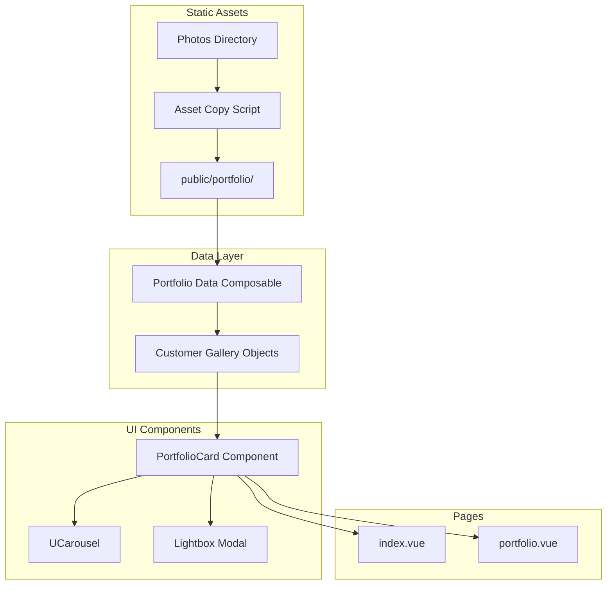
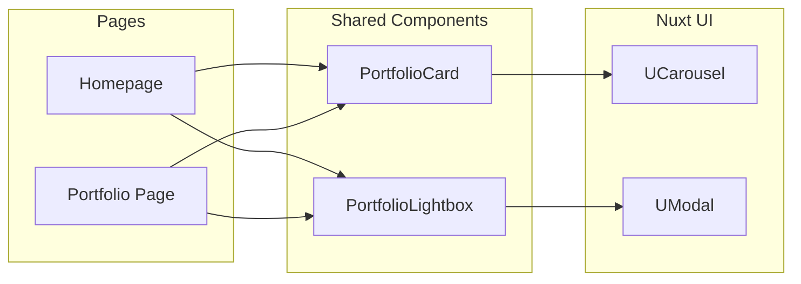

# Design Document: Homepage Portfolio Update

## Overview

This design document outlines the technical implementation for updating the Reneo.id wedding organizer website. The update involves streamlining the homepage by removing certain sections, implementing a dynamic portfolio system with real customer photos, and adding interactive features like swipeable carousels and lightbox image viewing.

The implementation leverages Nuxt 4's static asset handling and Nuxt UI components (UCarousel, UModal) to create a responsive, accessible, and performant portfolio experience.

## Architecture

### High-Level Architecture



### Component Architecture



## Components and Interfaces

### 1. Portfolio Data Composable

A composable that provides portfolio data and utility functions.

```typescript
// composables/usePortfolio.ts

interface CustomerGallery {
  id: string;                    // Unique identifier (e.g., "customer_1")
  folderName: string;            // Original folder name
  images: string[];              // Array of image paths relative to public
}

interface UsePortfolioReturn {
  galleries: ComputedRef<CustomerGallery[]>;
  getGalleryById: (id: string) => CustomerGallery | undefined;
  getPreviewGalleries: (count: number) => CustomerGallery[];
}

export function usePortfolio(): UsePortfolioReturn {
  // Returns all 24 customer galleries with their images
  // Galleries are sorted by folder number (newest first based on naming)
}
```

### 2. PortfolioCard Component

A reusable card component displaying a customer gallery with carousel.

```typescript
// components/PortfolioCard.vue

interface PortfolioCardProps {
  gallery: CustomerGallery;      // Gallery data to display
  onImageClick?: (image: string, gallery: CustomerGallery) => void;
}

// Features:
// - Displays UCarousel with gallery images
// - Navigation arrows and dot indicators
// - Click handler for lightbox trigger
// - Responsive sizing
// - No customer name display (privacy)
```

### 3. PortfolioLightbox Component

A modal component for displaying enlarged images.

```typescript
// components/PortfolioLightbox.vue

interface PortfolioLightboxProps {
  open: boolean;                 // Control modal visibility
  image: string;                 // Current image to display
  gallery?: CustomerGallery;     // Optional: for navigation within gallery
}

interface PortfolioLightboxEmits {
  'update:open': [value: boolean];
  'navigate': [direction: 'prev' | 'next'];
}

// Features:
// - Full-screen modal with dark overlay
// - Close button and click-outside-to-close
// - Keyboard navigation (Escape to close)
// - Optional prev/next navigation within gallery
```

### 4. Portfolio Configuration

Static configuration for portfolio data.

```typescript
// data/portfolioConfig.ts

// List of all customer folders with their images
// This is generated/maintained based on the public/portfolio directory

export const CUSTOMER_FOLDERS = [
  'customer_1',
  'customer_2',
  'customer_3',
  'customer_4',
  'customer_5',
  'customer_6',
  'customer_7',
  'customer_8',
  'customer_9',
  'Customer_10',
  'customer_11',
  'customer_12',
  'customer_13',
  'customer_14',
  'customer_15',
  'customer_16',
  'customer_17',
  'cuustomer_18',
  'customer_19',
  'customer_20',
  'customer_21',
  'customer_22',
  'customer_23',
  'customer_24',
] as const;

export interface PortfolioImageMap {
  [folderId: string]: string[];  // folder name -> array of image filenames
}
```

## Data Models

### CustomerGallery

```typescript
interface CustomerGallery {
  id: string;           // Normalized identifier (lowercase, e.g., "customer_10")
  folderName: string;   // Original folder name preserving case
  images: string[];     // Full paths: ["/portfolio/customer_1/img1.jpg", ...]
  imageCount: number;   // Total number of images in gallery
}
```

### LightboxState

```typescript
interface LightboxState {
  isOpen: boolean;
  currentImage: string | null;
  currentGallery: CustomerGallery | null;
  currentIndex: number;
}
```

### PortfolioPageState

```typescript
interface PortfolioPageState {
  galleries: CustomerGallery[];
  lightbox: LightboxState;
  isLoading: boolean;
}
```


## Correctness Properties

*A property is a characteristic or behavior that should hold true across all valid executions of a system—essentially, a formal statement about what the system should do. Properties serve as the bridge between human-readable specifications and machine-verifiable correctness guarantees.*

Based on the prework analysis of acceptance criteria, the following properties have been identified for property-based testing:

### Property 1: Image Paths Are Local Public Paths

*For any* image path in the portfolio data or rendered portfolio components, the path SHALL start with `/portfolio/` and SHALL NOT contain external URL schemes (http://, https://).

**Validates: Requirements 2.1, 2.3, 6.3**

### Property 2: Each Gallery Renders as Separate Card

*For any* CustomerGallery in the portfolio data, when rendered on the Portfolio_Page, there SHALL exist exactly one corresponding card element containing that gallery's images.

**Validates: Requirements 2.4**

### Property 3: No Customer Names Displayed

*For any* rendered portfolio card (on either Homepage or Portfolio_Page), the card content SHALL NOT contain any text matching customer folder names or customer identifying information.

**Validates: Requirements 2.5, 5.6**

### Property 4: Multi-Image Galleries Have Carousel Slides

*For any* CustomerGallery with more than one image, when rendered in a carousel, the carousel SHALL contain the same number of slide elements as images in the gallery.

**Validates: Requirements 3.1**

### Property 5: Preview Galleries Sorted by Recency

*For any* set of preview galleries displayed on the Homepage, the galleries SHALL be ordered such that higher-numbered customer folders appear before lower-numbered ones (assuming higher numbers represent more recent customers).

**Validates: Requirements 5.2**

### Property 6: Preview Cards Contain Carousels

*For any* preview card on the Homepage portfolio section, the card SHALL contain a UCarousel component with images from the corresponding CustomerGallery.

**Validates: Requirements 5.3**

## Error Handling

### Image Loading Errors

- **Missing Images**: If an image file is not found, display a placeholder or gracefully hide the broken image
- **Slow Loading**: Implement lazy loading for images to improve initial page load
- **Invalid Paths**: Validate image paths during build/development to catch configuration errors early

### Component Errors

- **Empty Gallery**: If a CustomerGallery has no images, skip rendering that gallery card
- **Carousel Errors**: If UCarousel fails to initialize, fall back to displaying the first image statically
- **Lightbox Errors**: If modal fails to open, log error and prevent broken UI state

### Data Errors

- **Missing Portfolio Config**: If portfolio configuration is missing, display an error message and log for debugging
- **Invalid Folder Names**: Handle folder naming variations (Customer_10, cuustomer_18) through normalization

## Testing Strategy

### Unit Tests

Unit tests will cover specific examples and edge cases:

1. **Portfolio Data Composable**
   - Test `getGalleryById` returns correct gallery
   - Test `getPreviewGalleries` returns exactly N galleries
   - Test handling of empty galleries
   - Test handling of naming variations

2. **Component Rendering**
   - Test PortfolioCard renders with valid gallery data
   - Test PortfolioLightbox opens and closes correctly
   - Test Homepage renders exactly 6 preview cards
   - Test Portfolio page renders all 24 galleries

3. **Edge Cases**
   - Gallery with single image (no carousel navigation needed)
   - Gallery with many images (10+)
   - Missing image files

### Property-Based Tests

Property-based tests will use a testing library (e.g., fast-check) to verify universal properties:

- **Configuration**: Minimum 100 iterations per property test
- **Tag Format**: `Feature: homepage-portfolio-update, Property N: [property description]`

Each correctness property from the design will be implemented as a single property-based test:

1. **Property 1 Test**: Generate random portfolio data, verify all paths are local
2. **Property 2 Test**: Generate random galleries, verify card count matches gallery count
3. **Property 3 Test**: Generate random gallery renders, verify no customer names in output
4. **Property 4 Test**: Generate galleries with varying image counts, verify slide counts match
5. **Property 5 Test**: Generate random gallery orderings, verify sorting is correct
6. **Property 6 Test**: Generate preview cards, verify each contains carousel with correct images

### Integration Tests

- Test full page render of Homepage with portfolio section
- Test full page render of Portfolio page with all galleries
- Test lightbox interaction flow (click image → modal opens → close)
- Test carousel navigation (arrows, dots, swipe)

### Manual Testing Checklist

- [ ] Verify all 24 customer galleries display correctly
- [ ] Verify no customer names appear anywhere
- [ ] Verify carousel swipe works on mobile devices
- [ ] Verify lightbox displays images at correct size
- [ ] Verify removed sections (Team, Services) are not visible
- [ ] Verify link to full portfolio page works
